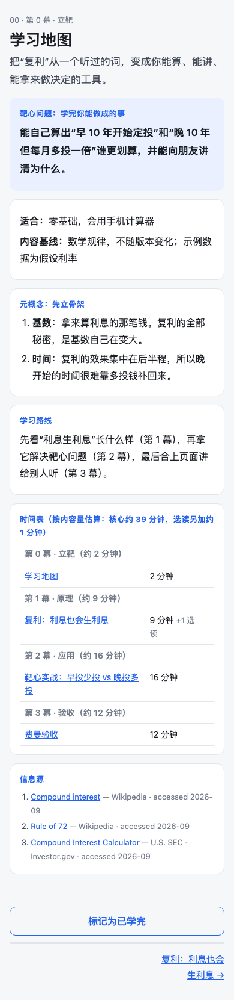
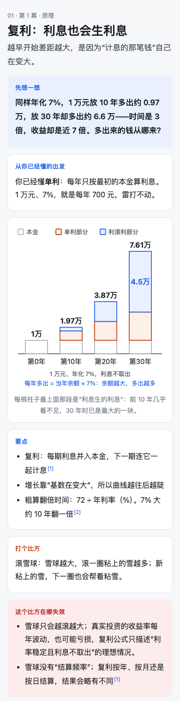

# learn-in-3-hours

一个 Claude Code skill：把“我想学 X”变成一套约 3 小时的图解 HTML 课程。课里的事实逐条对照一手来源核查，图在手机宽度下实测过，每页时长按实际内容量算出来。

> **English:** A Claude Code skill that turns "I want to learn X" into a ~3-hour illustrated HTML course: every factual claim is checked against a primary source, diagrams are measured at phone width, and study times are computed from the content. The skill instructions and the generated courses are in Chinese.

<p>

&nbsp;

</p>

上图是随 skill 附带的示例课程（复利，4 页）在 390px 手机宽度下的截图，源文件在 [`skills/learn-in-3-hours/assets/example/`](skills/learn-in-3-hours/assets/example/)。

## 它防的是哪几种失败

AI 生成的学习材料有几个常见问题。这个 skill 尽量用脚本或固定流程兜底，不靠“提醒模型注意”。

| 常见问题 | 怎么兜底 |
|---|---|
| 没问清就开工：同一句“我想学机器学习”可以是四门完全不同的课 | 两个确认点：调研前确认靶心和范围，写页面前确认大纲，都要等用户回复 |
| 过时或错误的事实被自测和复述反复练熟 | 每条可核查的说法进事实台账 `claims.json`，单独一轮去证伪；检查脚本拦下任何未核查的条目 |
| 电脑上好看，手机上看不清 | 图按 340 宽画；检查脚本在 390px 视口下实测每个标签的字号、重叠和溢出，并截图 |
| 标的时长和内容对不上 | 每页时长由构建脚本按内容量算出，写进页眉和时间表 |
| 图里摆了名词，却没讲清“为什么” | 新读者测试：让没看过正文的子 agent 只看截图和图注，讲不出图要教的因果就重画 |
| 每页单独看都合格，连起来却是割裂的 | 连贯性通读：新读者按页序读全课的文字版，找出前后接不上的地方 |

## 流程

```
0 开课确认 → 1 调研 → 2 大纲确认 → 3 逐页写，边写边登记事实
  → 4 核查（目标是证伪） → 5 构建 → 6 质检（0 错误 + 新读者测试 + 连贯性通读） → 7 交付
```

课程按四幕组织：立靶 → 原理 → 应用（最后一页是“靶心实战”，用学到的东西解决开课时定下的问题）→ 延伸，最后一页是费曼验收。每页有自测题（答案折叠）；每个类比后面都跟着“它在哪失效”。

交付物是一个文件夹，页面不依赖任何外部资源，可以离线打开：

```
learn-<slug>/
├── 00-map.html … 99-review.html   给学习者看的页面
└── _work/                          course.json、调研笔记、来源、事实台账、页面片段、质检报告和截图
```

完整规范见 [`SKILL.md`](skills/learn-in-3-hours/SKILL.md) 和 [`references/`](skills/learn-in-3-hours/references/)。

## 安装

**作为插件安装**（在 Claude Code 里）：

```
/plugin marketplace add brunoyang/learn-in-3-hours
/plugin install learn-in-3-hours@learn-in-3-hours
```

**或者直接链接到个人 skills 目录**：

```bash
git clone https://github.com/brunoyang/learn-in-3-hours.git
ln -s "$PWD/learn-in-3-hours/skills/learn-in-3-hours" ~/.claude/skills/learn-in-3-hours
```

依赖：
- Python 3，只用标准库。
- 本机的 Chrome、Chromium 或 Edge，用于手机渲染检查（也可以用 `CHROME_PATH` 指定）。找不到浏览器时会跳过这项检查并给出警告。

## 用法

在 Claude Code 里直接说，例如“我想学 PostgreSQL 查询优化，给我做个三小时的课”“带我搞懂美联储加息降息怎么影响美股”。

第一条回复是一张开课确认单：2–3 个候选靶心、使用场景、范围、内容基线（截至哪天、哪个版本）、时长和存放位置、预计成本。确认后它会先调研，再给出大纲等你确认，之后一直做到交付，中途不再打断。不想被问的话，直接说“不用问我，直接做”。

脚本也可以单独运行：

```bash
S=skills/learn-in-3-hours/scripts
python3 $S/build_course.py   <课程目录>                 # 生成页面，输出每页估算时长
python3 $S/check_course.py   <课程目录> [--no-render] [--full-shots]   # 质检，有错误时退出码为 1
python3 $S/merge_verdicts.py <课程目录> [--dry-run]     # 合并多个核查者的结论到台账和页面
```

`check_course.py` 遇到没有 `_work/course.json` 的目录时会进入通用模式，只检查外部依赖和手机渲染，可以拿来检查任何 HTML 页面集。

## 成本

一门 3 小时的课，完整流程大约要 1.5 小时、50 万 token 左右，另外还有并行核查子 agent 的消耗。确认完大纲之后不需要盯着。

## 评测

和原版 learn-in-3-hours skill 做过一次对照：2 个题目（Kafka 4.x 入门、美联储利率与股债），每个题目每个版本各跑 1 次，用 [`evals/grade.py`](evals/grade.py) 做 8 项客观检查。

| | 原版 | 本仓库（v1） |
|---|---|---|
| 客观检查通过率 | 44% | 94% |
| 耗时 | 约 55 分钟 | 约 85–98 分钟 |
| token | 约 30 万 | 约 50 万（另加核查子 agent） |

读这组数字时要注意：
- **样本很小**：每边只跑了 1 次，没有方差数据。
- **检查项对本仓库有利**：8 项检查（外部依赖、手机横向滚动、图中字号、标签重叠、每页有来源、写明基线、自测题带折叠答案、标的时长和内容量相差不超过 30%）大多正是本 skill 的检查脚本强制要求的。
- **事实准确性不是差距所在**：两个版本在这两个题目上的关键事实都写对了。本 skill 的核查轮在它自己的初稿里分别抓出并改掉了 19 处（Kafka）和 6 处（美联储）错误。
- 原版的几次运行都标称 180 分钟，按内容量估算约 70 分钟。
- 之后加的开课/大纲确认、新读者测试和连贯性通读，只做过回归测试，没有重跑完整对照。

评测用例见 [`evals/evals.json`](evals/evals.json)，其中 3、4 两条专门测两个确认点。

## 致谢

灵感来自朱卫军的 [learn-in-3-hours](https://github.com/zhuweijun1003-source/zhuwj-skills)。

## 许可证

[MIT](LICENSE)
